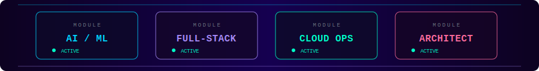
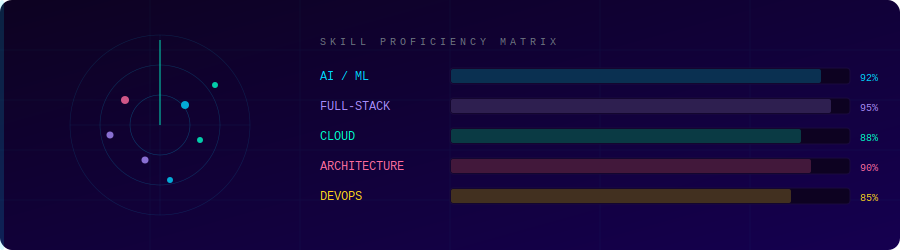
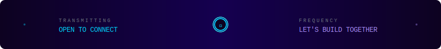

<div align="center">


<a href="https://git.io/typing-svg">
  
</a>

<br/>


&nbsp;
<a href="https://github.com/WosberbonDesu?tab=followers">
  
</a>
&nbsp;
<a href="https://github.com/WosberbonDesu?tab=repositories">
  
</a>

</div>

<br/>

<!-- 🚀 MISSION CONTROL BANNER -->
<div align="center">
  
</div>

<br/>

<!-- ◈ NEON DIVIDER -->
<div align="center">
  
</div>

<br/>

##  &nbsp;About Me

<table>
<tr>
<td width="50%" valign="top">

```js
const berkecan = {
  location: "Turkey 🇹🇷",
  role: "Full-Stack Engineer & AI Architect",
  focus: [
    "AI-Powered Applications",
    "Cloud-Native Architecture",
    "Scalable Distributed Systems"
  ],
  education: "Computer Science",
  passion: "Building products that make a difference",
  motto: "Engineer experiences, not just code."
};
```

</td>
<td width="50%" valign="top">

### 🎯 What I Bring to the Table

- 🧠 **AI & ML** — End-to-end ML pipelines, LLM integrations, RAG systems
- ⚡ **Full-Stack** — React/Next.js frontends + robust backend APIs
- ☁️ **Cloud** — AWS-certified, containerized microservices
- 🏗️ **Architecture** — System design for scale & resilience
- 🚀 **Product-Minded** — I think beyond code to user impact

</td>
</tr>
</table>

<br/>

<!-- ◈ STATUS DASHBOARD -->
<div align="center">
  
</div>

<br/>

<!-- ◈ NEON DIVIDER -->
<div align="center">
  
</div>

<br/>

##  &nbsp;Tech Stack

<div align="center">

### 🧠 AI & Machine Learning
<p>
  
  
  
  
  
  
</p>

### ⚡ Frontend
<p>
  
  
  
  
  
</p>

### 🔧 Backend
<p>
  
  
  
  
  
</p>

### ☁️ Cloud & DevOps
<p>
  
  
  
  
  
</p>

### 🗄️ Databases
<p>
  
  
  
  
</p>

</div>

<br/>

<!-- ◈ TECH RADAR -->
<div align="center">
  
</div>

<br/>

<!-- ◈ NEON DIVIDER -->
<div align="center">
  
</div>

<br/>

## 🏗️ &nbsp;Featured Projects

<div align="center">

<a href="https://github.com/WosberbonDesu">
  
</a>
&nbsp;&nbsp;
<a href="https://github.com/WosberbonDesu">
  
</a>

</div>

> 💡 **Note:** Replace `REPO_NAME_1` and `REPO_NAME_2` with your actual repository names to showcase your best work.

<br/>

<!-- ◈ NEON DIVIDER -->
<div align="center">
  
</div>

<br/>

## 📊 &nbsp;GitHub Analytics

<div align="center">


&nbsp;


</div>

<div align="center">


</div>

<br/>

## 📈 &nbsp;Contribution Graph

<div align="center">

[](https://github.com/WosberbonDesu)

</div>

<br/>

<!-- ◈ NEON DIVIDER -->
<div align="center">
  
</div>

<br/>

<!-- 📡 SIGNAL CONNECT BANNER -->
<div align="center">
  
</div>

<br/>

## 🤝 &nbsp;Let's Connect

<div align="center">

<a href="https://linkedin.com/in/YOUR_LINKEDIN">
  
</a>
&nbsp;
<a href="mailto:YOUR_EMAIL">
  
</a>
&nbsp;
<a href="https://YOUR_PORTFOLIO">
  
</a>
&nbsp;
<a href="https://github.com/WosberbonDesu">
  
</a>

</div>

<br/>

<div align="center">

```
⚡ "The best way to predict the future is to engineer it." ⚡
```

<br/>


</div>

<br/>


